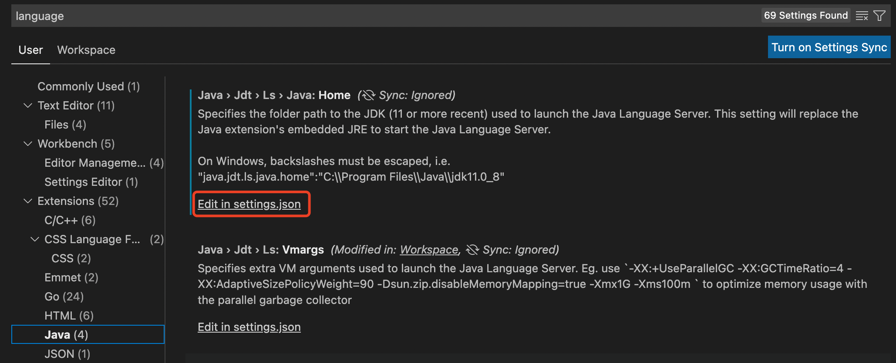
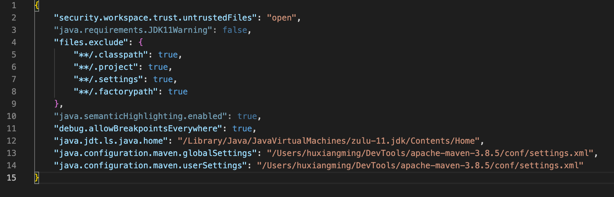
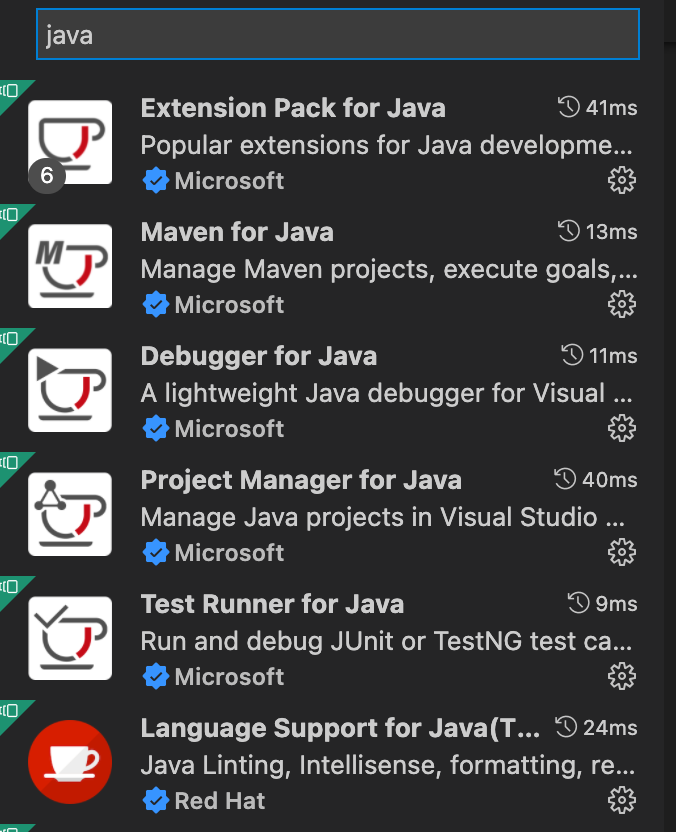
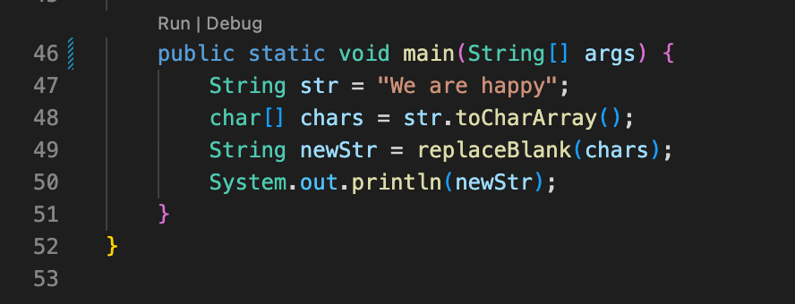

# IDE设置

## java开发环境设置

### Visual Studio Code设置

* 配置jdk11
  可以同时安装jdk8和jdk11，而vscode需要配置jdk11

* 打开设置：preferences -> settings，搜索language，结果中出现java
  

* 安装扩展

* 可以运行和调试程序

## IDE快捷键

### Intellij Idea快捷键
  
  |MAC|名称|WINDOWS|
  |:-|:-:|:-|
  |⌘N|自动生成get/set方法|Alt + Enter|
  |⌃⌥O|优化import|Ctrl + Alt + O|
  |⌃H|查看继承关系|Ctrl + H|
  |⌥⌘L|格式化代码|Ctrl + Alt +L|
  |⌘O|查找类文件|Ctrl + N|
  |⌘L|跳转到行号|Ctrl + G|
  |⌥space| 查看光标处的方法、类的定义|/|
  |⌘⇧F|全局查找|Ctrl + Shift + F|

### Visual Studio Code快捷键

* windows版<https://code.visualstudio.com/shortcuts/keyboard-shortcuts-windows.pdf>
* mac版<https://code.visualstudio.com/shortcuts/keyboard-shortcuts-macos.pdf>
  
  |MAC|名称|WINDOWS|
  |:-|:-:|:-|
  |⌘K⌘S|打开快捷键面板|Ctrl + K Ctrl + S|
  |⌃ + 反引号|调出终端/隐藏终端|Ctrl + 反引号|
  |⌥⇧F|格式化代码|Alt + Shift + F|
  |⌥←|移动到单词的最前面||
  |⌥→|移动到单词最末尾||
  |⌥↑|将当前行代码移动到上一行||
  |⌥↓|将当前行代码移动到下一行||
  |⌘←|移动到当前行最前面||
  |⌘→|移动到当前行最末尾||
  |⌘↑|移动到文档第一行||
  |⌘↓|移动到文档最后一行||
  |⌥⇧↓ / ⌥⇧↑|快速复制一行||
  |⌥↓ / ⌥↑|移动当前行向下/向上|Alt + Shift + ↓/↑|
  |⌥⇧A|切换块注释|Alt + Shift + A|
  |⌥⇧O|优化import|Alt + Shift + O|

  原文链接：<https://blog.csdn.net/m0_64346035/article/details/124192655>
