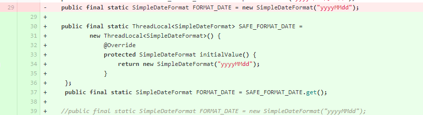
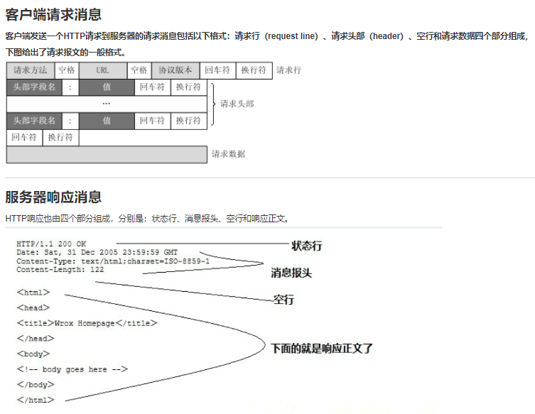
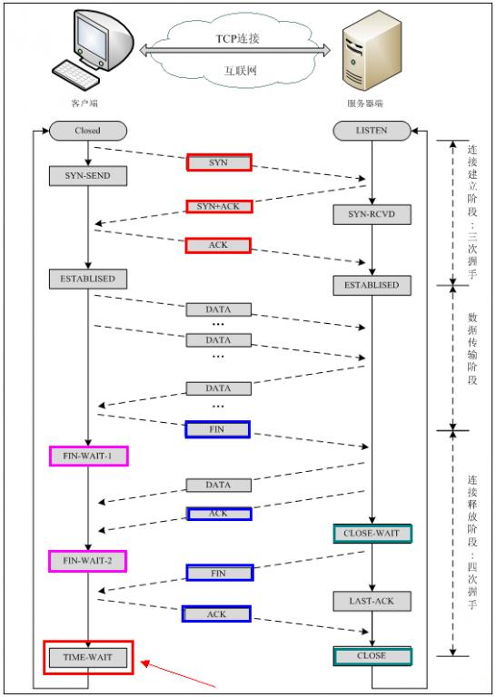

# algo
学习JDK源码与leetcode


一、jdk源码中类似的代码：

1，HashMap中的tableSizeFor方法

```java
static final int tableSizeFor(int cap) {
    int n = cap - 1;
    n |= n >>> 1;
    n |= n >>> 2;
    n |= n >>> 4;
    n |= n >>> 8;
    n |= n >>> 16;
    return (n < 0) ? 1 : (n >= MAXIMUM_CAPACITY) ? MAXIMUM_CAPACITY : n + 1;
}

例如，参数cap为十进制的14，n就是13：
13      0000 1101

>>>1    0000 0110
|=      0000 1111
>>>2    0000 0011
|=      0000 1111    (15)
>>>4    0000 0000
|=      0000 1111    (15)
>>>8    0000 0000
|=      0000 1111    (15)

经过多次右移之后再进行 | 运算，结果是最右边四位都是1
n = 15
n + 1 = 16
```

2，Integer中的highestOneBit方法

```java
public static int highestOneBit(int i) {
    // HD, Figure 3-1
    i |= (i >>  1);
    i |= (i >>  2);
    i |= (i >>  4);
    i |= (i >>  8);
    i |= (i >> 16);
    return i - (i >>> 1);
}
例如，i为十进制的13：
13      0000 1101
>>1     0000 0110
|=      0000 1111
>>2     0000 0011
|=      0000 1111    (15)
>>4     0000 0000
|=      0000 1111    (15)
>>8     0000 0000
|=      0000 1111    (15)
经过多次右移之后再进行 | 运算，结果是最右边四位都是1
i           0000 1111  (15)
i >>> 1     0000 0111  (7)
i - (i >>> 1) 得到
0000 1000  (8)
即15 - 7 = 8
```

二、System.out.print()方法，带有synchronized锁

```java
public final static PrintStream out = null;    // System类中

// PrintStream类
public void print(String s) {
    if (s == null) {
        s = "null";
    }
    write(s);
}

// write方法带有synchronized
private void write(String s) {
    try {
        synchronized (this) {
            ensureOpen();
            textOut.write(s);
            textOut.flushBuffer();
            charOut.flushBuffer();
            if (autoFlush && (s.indexOf('\n') >= 0))
                out.flush();
        }
    }
    catch (InterruptedIOException x) {
        Thread.currentThread().interrupt();
    }
    catch (IOException x) {
        trouble = true;
    }
}
```

三、java.util包中有一个Objects工具类
有equals, deepEquals, hashCode, hash, toString, compare等方法
```aidl

public static int hashCode(Object o) {
	return o != null ? o.hashCode() : 0;
}

public static int hash(Object... values) {
	return Arrays.hashCode(values);
}


```

四、HashMap 1.7和1.8的区别之一

​    1.7是头插法，1.8是尾插法

五、jdk中的Array类
1，在Arrays中有使用Array.newInstance方法
```aidl
    public static <T,U> T[] copyOf(U[] original, int newLength, Class<? extends T[]> newType) {
        @SuppressWarnings("unchecked")
        T[] copy = ((Object)newType == (Object)Object[].class)
            ? (T[]) new Object[newLength]
            : (T[]) Array.newInstance(newType.getComponentType(), newLength);
        System.arraycopy(original, 0, copy, 0,
                         Math.min(original.length, newLength));
        return copy;
    }
```
2，Array.class在反射包(java.lang.reflect)中
```aidl
    public static Object newInstance(Class<?> componentType, int length)
        throws NegativeArraySizeException {
        return newArray(componentType, length);
    }
```

六、jad反编译工具
1，下载：https://varaneckas.com/jad/
2，解压，不需其它安装操作
3，使用：打开cmd，切换到jad所在路径，执行命令：jad  D:\study\gitcode\algo\target\classes\jdk\ListArray.class
    注意是.class文件，得到一个.jad文件，用记事本打开就行
```aidl
// Decompiled by Jad v1.5.8g. Copyright 2001 Pavel Kouznetsov.
// Jad home page: http://www.kpdus.com/jad.html
// Decompiler options: packimports(3) 
// Source File Name:   ListArray.java

package jdk;

import java.io.PrintStream;
import java.util.Arrays;
import java.util.List;

public class ListArray
{

    public ListArray()
    {
    }

    public static void main(String args[])
    {
        int test[] = {
            1, 2, 3, 4
        };
        // 这里入参是一个二维数组，而且是一个1行三列的二维数组，所以size为1
        List list = Arrays.asList(new int[][] {
            test
        });
        System.out.println(list.size());
        Integer test2[] = {
            Integer.valueOf(1), Integer.valueOf(2), Integer.valueOf(3), Integer.valueOf(4)
        };
        List list2 = Arrays.asList(test2);
        System.out.println(list2.size());
    }
}

```

七、两个质数1231与1237
在Boolean.java中发现其hashCode方法的返回值，true返回1231，false返回1237，为什么选这两个质数？
```aidl
    public static int hashCode(boolean value) {
        return value ? 1231 : 1237;
    }
```

八、死锁
产生死锁必须具备以下四个条件：
1. 互斥条件：该资源任意一个时刻只由一个线程占用。
2. 请求与保持条件：一个进程因请求资源而阻塞时，对已获得的资源保持不放。
3. 不剥夺条件:线程已获得的资源在未使用完之前不能被其他线程强行剥夺，只有自己使用完毕后才释放资源。
4. 循环等待条件:若干进程之间形成一种头尾相接的循环等待资源关系。

为了避免死锁，我们只要破坏产生死锁的四个条件中的其中一个就可以了。现在我们来挨个分析一下：
1. **破坏互斥条件** ：这个条件我们没有办法破坏，因为我们用锁本来就是想让他们互斥的（临界资源需要互斥访问）。
2. **破坏请求与保持条件** ：一次性申请所有的资源。
3. **破坏不剥夺条件** ：占用部分资源的线程进一步申请其他资源时，如果申请不到，可以主动释放它占有的资源。
4. **破坏循环等待条件** ：依靠按序申请资源来预防。按某一顺序申请资源，释放资源则反序释放。破坏循环等待条件。

九、数据库

1，三范式（Normal Form）
1NF:字段不可分;
2NF:有主键，非主键字段依赖主键;
3NF:非主键字段不能相互依赖;

解释:
1NF:原子性 字段不可再分,否则就不是关系数据库;
2NF:唯一性 一个表只说明一个事物;
3NF:每列都与主键有直接关系，不存在传递依赖;

2，数据库还有第四、每五范式
BCNF : Boyce-Codd Normal Form可以看作更好的3NF。在满足第二第三范式的情况下，决定项内部也不能部分或传递依赖。
4NF：没有多值依赖

3，数据库设计涉及的名词
关系：一个关系对应通常所说的一张表
元组：表中的一行即为一个元组
属性：表中的一列即为一个属性；每一个属性都有一个名称，称为属性名
候选码：表中的某个属性组，它可以唯一确定一个元组
主码：一个关系有多个候选码，选定其中一个为主码
域：属性的取值范围
分量：元组中的一个属性值

十、线程池

```java
/** 
FixedThreadPool和SingleThreadPool使用的队列是LinkedBlockingQueue,这是无界队列，允许请求的最大长度为：Integer.MAX_VALUE，
可能会堆积大量的请求，从而导致OOM
*/
public static ExecutorService newFixedThreadPool(int nThreads) {
    return new ThreadPoolExecutor(nThreads, nThreads, 
                                  0L, TimeUnit.MILLISECONDS, 
                                  new LinkedBlockingQueue<Runnable>());
}

public static ExecutorService newSingleThreadExecutor() {
    return new FinalizableDelegatedExecutorService
        (new ThreadPoolExecutor(1, 1,
                                0L, TimeUnit.MILLISECONDS,
                                new LinkedBlockingQueue<Runnable>()));
}

/**
看看LinkedBlockingQueue的容量大小：Integer.MAX_VALUE
*/
public LinkedBlockingQueue() {
    this(Integer.MAX_VALUE);
}


/**
CachedThreadPool和ScheduleThreadPool允许的创建线程数量为：Integer.MAX_VALUE，可能会创建大量的线程，从而导致OOM
*/
public static ExecutorService newCachedThreadPool() {
    return new ThreadPoolExecutor(0, Integer.MAX_VALUE,
                                      60L, TimeUnit.SECONDS,
                                      new SynchronousQueue<Runnable>());
}

public static ScheduledExecutorService newScheduledThreadPool(int corePoolSize) {
    return new ScheduledThreadPoolExecutor(corePoolSize);
}

// ScheduledThreadPoolExecutor类
public ScheduledThreadPoolExecutor(int corePoolSize) {
    super(corePoolSize, Integer.MAX_VALUE, 0, NANOSECONDS,
          new DelayedWorkQueue());
}

/**
线程池参数分析
corePoolSize : 核心线程数
maximumPoolSize : 最大线程数
keepAliveTime : 非核心线程的超时时长,如果非核心线程闲置时间超过keepAliveTime之后，就会被回收。如果设置allowCoreThreadTimeOut为true，则该参数也表示				核心线程的超时时长
unit : 超时时长单位
workQueue : 线程池中的任务队列，该队列主要用来存储已经被提交但是尚未执行的任务
handler : 拒绝策略
*/
public ThreadPoolExecutor(int corePoolSize,
        int maximumPoolSize,
        long keepAliveTime,
        TimeUnit unit,
        BlockingQueue<Runnable> workQueue,
        RejectedExecutionHandler handler)
```


十一、HashMap中能保证元素有序的是哪个Map？


怎么保证有序？

查看源码，我们也会发现，linkedHashMap只是维护了一个链表，并没有put、remove方法的具体实现。

```java
/**
The iteration ordering method for this linked hash map: true for access-order, false for insertion-order.
true 访问顺序，false 插入顺序
*/
final boolean accessOrder;
```

添加元素要调用父类的put方法：


而linkedHashMap重写了newNode方法：

```java
/**
先new一个节点，然后调用linkNodeLast，将新的节点加到链表末尾
*/
Node<K,V> newNode(int hash, K key, V value, Node<K,V> e) {
    LinkedHashMap.Entry<K,V> p =
        new LinkedHashMap.Entry<K,V>(hash, key, value, e);
    linkNodeLast(p);
    return p;
}

/**
link at the end of list
原来的尾指向p，p指向原来的尾，双向链表
*/
private void linkNodeLast(LinkedHashMap.Entry<K,V> p) {
    LinkedHashMap.Entry<K,V> last = tail;
    tail = p;
    if (last == null)
        head = p;
    else {
        p.before = last;
        last.after = p;
    }
}


/**
如果在初始化linkedHashMap对象的时候，accessOrder设为true，则表示按照访问顺序有序，在get方法中，会对访问到的元素进行处理
*/
public V get(Object key) {
    Node<K,V> e;
    if ((e = getNode(hash(key), key)) == null)
        return null;
    if (accessOrder)
        afterNodeAccess(e);
    return e.value;
}

void afterNodeAccess(Node<K,V> e) { // move node to last
    LinkedHashMap.Entry<K,V> last;
    if (accessOrder && (last = tail) != e) {
        LinkedHashMap.Entry<K,V> p =
            (LinkedHashMap.Entry<K,V>)e, b = p.before, a = p.after;
        p.after = null;
        if (b == null)
            head = a;
        else
            b.after = a;
        if (a != null)
            a.before = b;
        else
            last = b;
        if (last == null)
            head = p;
        else {
            p.before = last;
            last.after = p;
        }
        tail = p;
        ++modCount;
    }
}

// LinkedHashMap的5个构造方法
public LinkedHashMap(int initialCapacity, float loadFactor) {
    super(initialCapacity, loadFactor);
    accessOrder = false;
}

public LinkedHashMap(int initialCapacity) {
    super(initialCapacity);
    accessOrder = false;
}

public LinkedHashMap() {
    super();
    accessOrder = false;
}

public LinkedHashMap(Map<? extends K, ? extends V> m) {
    super();
    accessOrder = false;
    putMapEntries(m, false);
}

// 只有这个方法，可以由外部设定accessOrder
public LinkedHashMap(int initialCapacity,
                         float loadFactor,
                         boolean accessOrder) {
    super(initialCapacity, loadFactor);
    this.accessOrder = accessOrder;
}
```

十二、BeanFactory与FactoryBean
1，BeanFactory 是接口，提供了IOC容器最基本的形式，给具体的IOC容器的实现提供了规范，功能非常复杂。
2，FactoryBean 也是接口，为IOC容器中Bean的实现提供了更加灵活的方式，FactoryBean在IOC容器的基础上给Bean的实现加上了一个简单的
工厂模式和装饰模式 ，我们可以在getObject()方法中灵活配置.

如果我们想要编写一些比较复杂点儿的逻辑就会触及到其他一些不必要的接口，或者只是想简单的去构造Bean，不希望实现IOC容器原有的大量方法，这时候就可以使用FactoryBean

3，FactoryBean的实际应用

（1）使用MyBatis时就用到了FactoryBean

```xml
<!-- SqlSessionFactory -->
<bean id="dgSqlSessionFactory"  class="org.mybatis.spring.SqlSessionFactoryBean">
    <property name="dataSource" ref="dgDataSource"/>
    <!-- mybatis配置文件路径-->
    <property name="configLocation"  value="classpath:mybatis-config.xml"/>   
    <!-- 实体类映射文件路径-->
    <property name="mapperLocations" value="classpath*:query-mapping/**/*.xml"/>
</bean>
```


```java
package org.mybatis.spring;

// 省略imports

public class SqlSessionFactoryBean implements FactoryBean<SqlSessionFactory>, InitializingBean, ApplicationListener<ApplicationEvent> {
    private static final Log LOGGER = LogFactory.getLog(SqlSessionFactoryBean.class);
    private Resource configLocation;
    private Resource[] mapperLocations;
    private DataSource dataSource;
    private TransactionFactory transactionFactory;
    private Properties configurationProperties;
    private SqlSessionFactoryBuilder sqlSessionFactoryBuilder = new SqlSessionFactoryBuilder();
    private SqlSessionFactory sqlSessionFactory;
    
    // 中间省略很多代码
    
    public SqlSessionFactory getObject() throws Exception {
        if (this.sqlSessionFactory == null) {
            this.afterPropertiesSet();
        }

        return this.sqlSessionFactory;
    }

    public Class<? extends SqlSessionFactory> getObjectType() {
        return this.sqlSessionFactory == null ? SqlSessionFactory.class : this.sqlSessionFactory.getClass();
    }

    public boolean isSingleton() {
        return true;
    }
    
}
```

（2）quartz定时器

```java
package org.springframework.scheduling.quartz;

// 省略imports

public class SchedulerFactoryBean extends SchedulerAccessor implements FactoryBean<Scheduler>, BeanNameAware, ApplicationContextAware, InitializingBean, DisposableBean, SmartLifecycle {
    public static final String PROP_THREAD_COUNT = "org.quartz.threadPool.threadCount";
    public static final int DEFAULT_THREAD_COUNT = 10;
    private static final ThreadLocal<ResourceLoader> configTimeResourceLoaderHolder = new ThreadLocal();
    private static final ThreadLocal<Executor> configTimeTaskExecutorHolder = new ThreadLocal();
    private static final ThreadLocal<DataSource> configTimeDataSourceHolder = new ThreadLocal();
    private static final ThreadLocal<DataSource> configTimeNo
        
    // 省略代码    
        
}
```

十三、Spring的事务传播机制
REQUIRED: Spring默认的事务传播类型，如果当前没有事务，就自己创建一个事务，如果当前存在事务，就加入到该事务中
SUPPORTS: 当前存在事务，则加入当前事务，如果不存在事务，就以非事务方法执行
MANDATORY: 当前存在事务，则加入当前事务，如果当前事务不存在，则抛异常
REQUIRES_NEW: 创建一个新事务，如果存在当前事务，则挂起该事务
NOT_SUPPORTED: 以非事务方式执行，如果当前存在事务，则挂起该事务
NEVER: 不使用事务，如果当前事务存在，则抛出异常
NESTED: 如果当前事务存在，则在嵌套事务中执行，否则开启一个事务

十四、Spring事务什么时候会失效
    Spring事务的原理是AOP，进行了切面增强，那么失效的根本原因就是这个AOP不起作用了。常见情况有以下几种：
1，自调用
   类里面使用this调用本类的方法（this通常省略），此时这个this对象不是代理类，而是对象本身
   解决方法很简单，使用代理类调用该方法
2，方法不是public
   @Transactional只能用于public方法上，否则事务不会生效，如果偏要用在非public方法上，可以开启AspectJ代理模式
3，数据库不支持事务
4，没有被Spring管理
5，异常被吃掉，事务不会回滚（或者抛出的异常没有被定义，默认为RuntimeException）

十五、项目中使用dubbo的版本
大致了解一下dubbo的版本更新事件：
2012年10月23号   2.5.3
2017年9月27号     2.5.4
2018年1月8号       2.6.0    此版本合并了dubbox
2019年5月             2.7.2

阿里的dubbo最后一个版本号是2.6.10.1，之后就捐赠给了apache


apache的dubbo版本从2.7.0开始


1，引用的jar包的版本：2.6.8
2，xml中配置的dubbo版本号

```xml
<!-- 使用的版本号为 1.0.0 -->
<dubbo:service registry="loan" version="1.0.0" scope="remote" register="true"
               interface="com.abc.pfs.service.api.QueryService" ref="queryService"/>
```

3，默认的协议：序列化 hessian2，传输 dubbo

```xml
<!-- 序列化协议 hessian2 -->
<dubbo:provider serialization="hessian2" retries="0"  filter="setOrg" timeout="${dubbo.provider.timeout:3000}"
                threads="${dubbo.provider.threads:300}" />
<!-- 传输协议 dubbo -->
<dubbo:protocol name="dubbo" port="${dubbo.protocol.port}" />
```


十六、单例模式，为什么枚举型单例是安全的？

因为反射包下的Constructor中的newInstance方法，不允许通过反射获取枚举的实例

```java
// java.lang.reflect.Constructor
public T newInstance(Object ... initargs)
        throws InstantiationException, IllegalAccessException,
               IllegalArgumentException, InvocationTargetException
{
   if (!override) {
     if (!Reflection.quickCheckMemberAccess(clazz, modifiers)) {
        Class<?> caller = Reflection.getCallerClass();
        checkAccess(caller, clazz, null, modifiers);
     }
   }
   // 如果是ENUM，抛出异常
   if ((clazz.getModifiers() & Modifier.ENUM) != 0)
      throw new IllegalArgumentException("Cannot reflectively create enum objects");
   ConstructorAccessor ca = constructorAccessor;   // read volatile
   if (ca == null) {
     ca = acquireConstructorAccessor();
   }
   @SuppressWarnings("unchecked")
   T inst = (T) ca.newInstance(initargs);
     return inst;
}
```

十七、Dubbo SPI

1，与Java SPI相比，Dubbo SPI做了一定的改进和优化：

（1）JDK标准的SPI会一次性实例化扩展点所有实现，如果有扩展实现则初始化很耗时，如果没有用上也加载，则浪费资源
（2）如果扩展加载失败，则连扩展的名称都获取不到了，加载失败的真正原因被“吃掉”了，报的错并不是真正失败的原因
（3）增加了对扩展IOC和AOP的支持，一个扩展可以直接setter注入其他扩展。在Java SPI使用中，java.util.ServiceLoader
会一次把某接口下的所有实现庆全部初始化，用户直接调用即可。 Dubbo SPI只是加载配置文件中的类，并分成不同的种类缓存
在内存中，而不会立即全部初始化，在性能上有更好的表现。

2，ExtensionLoader的工作原理


ExtensionLoader的逻辑入口可以分为：

（1）getExtension  获取普通扩展类

（2）getAdaptiveExtension  获取自适应扩展类

（3）getActivateExtension  获取自动激活的扩展类

3，扩展点动态编译的实现

Dubbo中有三种代码编译器：JdkCompiler、JavassitCompiler和AdaptiveCompiler


```java
/**
注解的默认值是javassist，即Javassist编译器将作为默认编译器。
如果用户想改变默认编译器，则可以通过<dubbo:application compiler="jdk" />标签进行配置
*/
@SPI("javassist")
public interface Compiler {
    Class<?> compile(String code, ClassLoader classLoader);
}
```


（1）JdkCompiler使用了JDK自带的编译器


```java
import javax.tools.DiagnosticCollector;
import javax.tools.FileObject;
import javax.tools.ForwardingJavaFileManager;
import javax.tools.JavaCompiler;
import javax.tools.JavaFileManager;
import javax.tools.JavaFileObject;
import javax.tools.SimpleJavaFileObject;
import javax.tools.StandardJavaFileManager;
import javax.tools.StandardLocation;
import javax.tools.ToolProvider;
import javax.tools.JavaFileManager.Location;
import javax.tools.JavaFileObject.Kind;
public class JdkCompiler extends AbstractCompiler {.......}
```

（2）Javassist编译器

```java
public class JavassitCompiler extends AbstractCompiler {.......}
```

（3）Adaptive编译器

```java
/**
AdaptiveCompiler直接实现Compiler，没有继承AbstractCompiler
注解@Adaptive，说明AdaptiveCompiler会固定为默认实现，这个Compiler的主要作用就是为了管理其他compiler
*/
@Adaptive
public class AdaptiveCompiler implements Compiler {
    private static volatile String DEFAULT_COMPILER;

    public AdaptiveCompiler() {
    }

    // 设置默认的编译器名称
    public static void setDefaultCompiler(String compiler) {
        DEFAULT_COMPILER = compiler;
    }

    // 通过ExtensionLoader获取对应的编译器扩展类实现，并调用真正的compiler做编译
    public Class<?> compile(String code, ClassLoader classLoader) {
        ExtensionLoader<Compiler> loader = ExtensionLoader.getExtensionLoader(Compiler.class);
        String name = DEFAULT_COMPILER;
        Compiler compiler;
        if (name != null && name.length() > 0) {
            compiler = (Compiler)loader.getExtension(name);
        } else {
            compiler = (Compiler)loader.getDefaultExtension();
        }

        return compiler.compile(code, classLoader);
    }
}
```

十八、什么是MVCC

1，MVCC是Muiti-Version Concurrency Control的简写，即多版本并发控制：读取数据时通过一种类似快照的方式将数据保存下来，这样读锁和写锁就不冲突了，不同的事务session会看到自己特定版本的数据，版本链

MVCC只有在READ COMMITTED和REPEATABLE READ两个隔离级别下工作。其他两个隔离级别和MVCC不兼容，因为READ UNCOMMITTED总是读取最新的数据行，而不是符合当前事务版本的数据行。而SERIALIZABLE则会对所有读取的行都加锁。

2，聚簇索引记录中有两个必要的隐藏列：
（1）trx_id  用来存储每次对某条聚簇索引记录进行修改时候的事务id
（2）roll_pointer  每次对哪条聚簇索引记录有修改的时候，都会把老版本写入undo日志中。这个roll_pointer就是存了一个指针，
它指向这条聚簇索引记录的上一个版本的位置，通过它来获得上一个版本的记录信息（注意插入操作的undo日志没有这个属性，因为它没有老版本）

3，READ COMMITTED和REPEATABLE READ的区别就在于它们生成READVIEW的策略不同：
（1）READ COMMITTED隔离级别下的事务在每次查询的开始都会生成一个独立的READVIEW
（2）REPEATABLE READ隔离级别则在第一次读的时候生成一个READVIEW，之后的读都复用之前的READ VIEW

4，开启事务时创建readview,readview维护当前活动的事务id，即未提交的事务尖，排序生成一个数组
访问数据，获取数据中的事务id（获取的是事务id最大的记录），对比readview:
（1）如果在readview的左边（比readview小），可以访问（在左边意味着该事务已经提交）
（2）如果在readview的右边（比readview大），或者在readview区间内，不可以访问，获取roll_pointer，取上一版本重新对比（在右边意味着，该事务在readview生成之后出现；在readview区间内意味着该事务还未提交）

十九、mysql主从同步原理

1，有三个线程：binlog dump thread（master）、I/O thread（slave）和sql thread（slave）

2，过程：
（1）主节点binlog，主从复制的基础是主库记录数据库的所有变更记录到binlog。binlog在数据库服务器启动那一刻起，保存所有修改数据库结构或内容的一个文件
（2）主节点log dump线程：当log有变动时，log dump线程读取其内容并发送给从节点
（3）从节点I/O线程接收binlog内容，并将其写入到relay log文件中
（4）从节点sql线程读取relay log文件内容，对数据更新进行同步，最终保证主从数据库的一致性

3，同步方式
（1）异步复制：mysql默认的复制方式
（2）全同步复制：主库强制同步日志到从库，所有的从库都执行完成后才返回给客户端，此方式性能不高
（3）半同步复制：从库写入日志成功后返回ACK确认给主库，主库收到至少一个从库的确认就认为同步操作完成

二十、Spring循环依赖


1，spring内部有三级缓存：
    singletonObjects 一级缓存，用于保存实例化、注入、初始化完成的bean实例
    earlySingletonObjects 二级缓存，用于保存实例化完成的bean实例
    singletonFactories 三级缓存，用于保存bean创建工厂，以便于后面扩展有机会创建代理对象。

摘自博客：[spring: 我是如何解决循环依赖的？ - Mars独行侠 - 博客园 (cnblogs.com)](https://www.cnblogs.com/wjxzs/p/14239052.html)

2，Spring中的DependsOn注解

```java
package org.springframework.context.annotation;

import java.lang.annotation.Documented;
import java.lang.annotation.ElementType;
import java.lang.annotation.Retention;
import java.lang.annotation.RetentionPolicy;
import java.lang.annotation.Target;

@Target({ElementType.TYPE, ElementType.METHOD})
@Retention(RetentionPolicy.RUNTIME)
@Documented
public @interface DependsOn {
    String[] value() default {};
}
```

3，AbstractBeanFactory中DependsOn相关代码：

```java
try {
    RootBeanDefinition mbd = this.getMergedLocalBeanDefinition(beanName);
    this.checkMergedBeanDefinition(mbd, beanName, args);
    String[] dependsOn = mbd.getDependsOn();
    String[] var11;
    if (dependsOn != null) {
        var11 = dependsOn;
        int var12 = dependsOn.length;

        for(int var13 = 0; var13 < var12; ++var13) {
            String dep = var11[var13];
            if (this.isDependent(beanName, dep)) {
                throw new BeanCreationException(mbd.getResourceDescription(), beanName, "Circular depends-on relationship between '" + beanName + "' and '" + dep + "'");
            }

            this.registerDependentBean(dep, beanName);

            try {
                this.getBean(dep);
            } catch (NoSuchBeanDefinitionException var24) {
                throw new BeanCreationException(mbd.getResourceDescription(), beanName, "'" + beanName + "' depends on missing bean '" + dep + "'", var24);
            }
        }
    }
 // 省略代码   
}
```

二十一、HashMap中转化为红黑树的阈值为什么是8，退化的阈值为什么是6？

```java
public class HashMap<K,V> extends AbstractMap<K,V>
    implements Map<K,V>, Cloneable, Serializable {

    private static final long serialVersionUID = 362498820763181265L;
    
	/*
        * Because TreeNodes are about twice the size of regular nodes, we
        * use them only when bins contain enough nodes to warrant use
        * (see TREEIFY_THRESHOLD). And when they become too small (due to
        * removal or resizing) they are converted back to plain bins.  In
        * usages with well-distributed user hashCodes, tree bins are
        * rarely used.  Ideally, under random hashCodes, the frequency of
        * nodes in bins follows a Poisson distribution
        * (http://en.wikipedia.org/wiki/Poisson_distribution) with a
        * parameter of about 0.5 on average for the default resizing
        * threshold of 0.75, although with a large variance because of
        * resizing granularity. Ignoring variance, the expected
        * occurrences of list size k are (exp(-0.5) * pow(0.5, k) /
        * factorial(k)). The first values are:
        *
        * 0:    0.60653066
        * 1:    0.30326533
        * 2:    0.07581633
        * 3:    0.01263606
        * 4:    0.00157952
        * 5:    0.00015795
        * 6:    0.00001316
        * 7:    0.00000094
        * 8:    0.00000006
        * more: less than 1 in ten million
        
        
        ......
        */
    /**
    在理想情况下,使用随机哈希码,节点出现的频率在hash桶中遵循泊松分布，同时给出了桶中元素个数和概率的对照表。
	从上面的表中可以看到当桶中元素到达8个的时候，概率已经变得非常小，也就是说用0.75作为加载因子，每个碰撞位置的链表长度超过８个是几乎不可能的。
    */
    static final int TREEIFY_THRESHOLD = 8;
    
    static final int UNTREEIFY_THRESHOLD = 6;
```

二十二、Spring如何解决循环依赖？


1, 获取Bean
AbstractBeanFactory.doGetBean

```java
protected <T> T doGetBean(String name, @Nullable Class<T> requiredType, @Nullable Object[] args, boolean typeCheckOnly) throws BeansException {
        String beanName = this.transformedBeanName(name);
        Object sharedInstance = this.getSingleton(beanName);
        Object bean;
        if (sharedInstance != null && args == null) {
            if (this.logger.isTraceEnabled()) {
                if (this.isSingletonCurrentlyInCreation(beanName)) {
                    this.logger.trace("Returning eagerly cached instance of singleton bean '" + beanName + "' that is not fully initialized yet - a consequence of a circular reference");
                } else {
                    this.logger.trace("Returning cached instance of singleton bean '" + beanName + "'");
                }
            }

            bean = this.getObjectForBeanInstance(sharedInstance, name, beanName, (RootBeanDefinition)null);
        } else {
            // 省略
        }
}
```


#第一次查询

DefaultSingletonBeanRegistry.getSingleton

```java
@Nullable
public Object getSingleton(String beanName) {
    return this.getSingleton(beanName, true);
}

@Nullable
protected Object getSingleton(String beanName, boolean allowEarlyReference) {
    Object singletonObject = this.singletonObjects.get(beanName);
    if (singletonObject == null && this.isSingletonCurrentlyInCreation(beanName)) {
        singletonObject = this.earlySingletonObjects.get(beanName);
        if (singletonObject == null && allowEarlyReference) {
            synchronized(this.singletonObjects) {
                singletonObject = this.singletonObjects.get(beanName);
                if (singletonObject == null) {
                    singletonObject = this.earlySingletonObjects.get(beanName);
                    if (singletonObject == null) {
                        ObjectFactory<?> singletonFactory = (ObjectFactory)this.singletonFactories.get(beanName);
                        if (singletonFactory != null) {
                            singletonObject = singletonFactory.getObject();
                            this.earlySingletonObjects.put(beanName, singletonObject);
                            this.singletonFactories.remove(beanName);
                        }
                    }
                }
            }
        }
    }

    return singletonObject;
}
```


2, 创建
#开始创建
AbstractAutowireCapableBeanFactory.doCreateBean

```java
protected Object doCreateBean(String beanName, RootBeanDefinition mbd, @Nullable Object[] args) throws BeanCreationException {
        BeanWrapper instanceWrapper = null;
        if (mbd.isSingleton()) {
            instanceWrapper = (BeanWrapper)this.factoryBeanInstanceCache.remove(beanName);
        }

        if (instanceWrapper == null) {
            instanceWrapper = this.createBeanInstance(beanName, mbd, args);
        }

        Object bean = instanceWrapper.getWrappedInstance();
        Class<?> beanType = instanceWrapper.getWrappedClass();
        if (beanType != NullBean.class) {
            mbd.resolvedTargetType = beanType;
        }

        synchronized(mbd.postProcessingLock) {
            // 省略代码
        }
}
```


#创建实例
createBeanInstance
#填充属性
populateBean
#初始化


initializeBean
    #填充 beanName
    invokeAwareMethods
    #前置处理
    applyBeanPostProcessorsBeforeInitialization
    #初始化方法
    invokeInitMethods
    #后置处理（AOP动态代理）
    applyBeanPostProcessorsAfterInitialization

AOP处理
#后置处理  触发动态代理
AbstractAutoProxyCreator.postProcessAfterInitialization
#创建动态代理
AbstractAutoProxyCreator.createProxy

解决循环依赖：提前引用
#提前引用
getEarlyBeanReference()
    #创建代理
    createProxy


二十三、Spring的依赖注入（DI）
### Constructor-based Dependency Injection
Constructor-based DI is accomplished by the container invoking a constructor with a number of arguments, each representing a dependency. Calling a static factory method with specific arguments to construct the bean is nearly equivalent, and this discussion treats arguments to a constructor and to a static factory method similarly.
### Setter-based Dependency Injection
Setter-based DI is accomplished by the container calling setter methods on your beans after invoking a no-argument constructor or a no-argument static factory method to instantiate your bean.

基于Setter的DI是由容器在调用无参数构造函数或无参数`静态`工厂方法实例化bean后调用bean上的Setter方法来实现的。

## Constructor-based or setter-based DI?
Since you can mix constructor-based and setter-based DI, it is a good rule of thumb to use constructors for mandatory dependencies and setter methods or configuration methods for optional dependencies. Note that use of the @Required annotation on a setter method can be used to make the property be a required dependency; however, constructor injection with programmatic validation of arguments is preferable.

The Spring team generally advocates constructor injection, as it lets you implement application components as immutable objects and ensures that required dependencies are not null. Furthermore, constructor-injected components are always returned to the client (calling) code in a fully initialized state. As a side note, a large number of constructor arguments is a bad code smell, implying that the class likely has too many responsibilities and should be refactored to better address proper separation of concerns.

Setter injection should primarily only be used for optional dependencies that can be assigned reasonable default values within the class. Otherwise, not-null checks must be performed everywhere the code uses the dependency. One benefit of setter injection is that setter methods make objects of that class amenable to reconfiguration or re-injection later. Management through JMX MBeans is therefore a compelling use case for setter injection.

Use the DI style that makes the most sense for a particular class. Sometimes, when dealing with third-party classes for which you do not have the source, the choice is made for you. For example, if a third-party class does not expose

二十四、双亲委派模型
1，三层类加载器
（1）启动类加载器（Bootstrap Class Loader）：
    无父类加载器
    加载范围：存放在<JAVA_HOME>\lib目录，或者被-Xbootclasspath参数所指定的路径中存放的，而且是Java虚拟机能够识别的类库
（2）扩展类加载器（Extension Class Loader）：
    父类加载器就是Bootstrap Class Loader
    加载范围：存放在<JAVA_HOME>\lib\ext目录，或者被java.ext.dirs系统变量所指定的路径中所有的类库
（2）应用程序类加载器（Application Class Loader）：
    父类加载器就是Extension Class Loader
    加载范围：用户类路径（ClassPath）上所有的类库

2，工作过程
如果一个类加载哭收到了类加载的请求，它首先不会自己去尝试加载这个类，而是把这个请求委派给父类加载器去完成，每一个层次的类加载器都是如此，因此所有的加载请求最终都应该传送到最顶层的启动类加载器中，只有当父加载器反馈自己无法完成这个加载请求（它的搜索范围中没有找到所需要的类）时，子加载器才会尝试自己去完成加载
3，破坏双亲委派模型
（1）JDK1.2以前
    双亲委派模型是JDK1.2之后才引入的，已有的代码有很多重写ClassLoader中的loadClass()方法，而双亲委派的具体逻辑就在这个loadClass()方法里，所以Java设计者们引入双亲委派模型时不得不做出一些妥协，为了兼容这些已有代码，无法再以技术手段避免loadClass()被子类覆盖的可能性，只能在JDK1.2之后的java.lang.ClassLoader中添加一个新的protected方法findClass()，并引导用户编写的类加载逻辑时尽可能去重写这个方法，而不是在loadClass()中编写代码。

```java
/**
Finds the class with the specified binary name. This method should be overridden by class loader implementations that follow the delegation model for loading classes, and will be invoked by the loadClass method after checking the parent class loader for the requested class. The default implementation throws a ClassNotFoundException.
Params: name – The binary name of the class
Returns: The resulting Class object
Throws: ClassNotFoundException – If the class could not be found
Since: 1.2
*/
protected Class<?> findClass(String name) throws ClassNotFoundException {
        throw new ClassNotFoundException(name);
    }
```


（2）Java SPI服务
    比如JNDI、JDBC等的实现类是由不同厂商实现并部署在应该程序的ClassPath下的。解决方法：引入线程上下文类加载器（Thread Context ClassLoader）。这个类加载器可以通过java.lang.Thread类的setContextClassLoader()方法进行设置，如果创建线程时还未设置，它将会从父线程中继承一个，如果在应用程序的全局范围内都没有设置过的话，那这个类加载器默认就是应用程序类加载器。    

```java
// since 1.2
public void setContextClassLoader(ClassLoader cl) {
    SecurityManager sm = System.getSecurityManager();
    if (sm != null) {
        sm.checkPermission(new RuntimePermission("setContextClassLoader"));
    }
    contextClassLoader = cl;
}
```

缺点：当SPI的服务提供者多于一个的时候，代码就只能根据具体提供者的类型来硬编码判断，为了解决这个问题，JDK 6提供了java.util.ServiceLoader类，以META-INF/services中的配置信息，辅以责任链模式，才给SPI的加载提供了一个相对合理的解决方案

```java
// since 1.6
public final class ServiceLoader<S>
    implements Iterable<S>
{
    // 省略其他
    
    public static <S> ServiceLoader<S> load(Class<S> service) {
        ClassLoader cl = Thread.currentThread().getContextClassLoader();
        return ServiceLoader.load(service, cl);
    }
    
    public static <S> ServiceLoader<S> loadInstalled(Class<S> service) {
        ClassLoader cl = ClassLoader.getSystemClassLoader();
        ClassLoader prev = null;
        while (cl != null) {
            prev = cl;
            cl = cl.getParent();
        }
        return ServiceLoader.load(service, prev);
    }
    
    // 省略其他
    
}
```


（3）用户对程序动态性的追求，OSGi实现模块化热部署，它自定义的类加载器机制


二十五、轻量级锁

工作过程：在代码即将进入同步块的时候，如果此同步对象没有被锁定（锁标志位为“01”状态），虚拟机首先将在当前线程的栈帧中建立一个名为锁记录（Lock Record）的空间，用于存储对象目前的mark word的拷贝（Displaced Mark Word）。

然后虚拟机将使用CAS操作尝试把对象的Mark Word更新为指向Lock Record的指针。

（1）如果这个更新动作成功了，即代表该线程拥有了这个对象的锁，并且对象Mark Word的锁标志位将转变了“00”，表示此对象处于轻量级锁定状态。

（2）如果更新失败，那就意味着至少存在一条线程与当前线程竞争获取该对象的锁。虚拟机首先会检查对象的Mark Word是否指向当前线程的栈帧，如果是，说明当前线程已经拥有了这个对象的锁，那直接进入同步块继续执行就可以了，否则说明这个锁对象已经被其他线程抢占了。如果出现2条以上的线程争用同一个锁的情况，那轻量级锁就不再有效，必须膨胀为重量级锁，锁标志的状态值变为“10”


二十六、AtomicInteger 线程安全原理

```java
public class AtomicInteger extends Number implements java.io.Serializable {
    private static final long serialVersionUID = 6214790243416807050L;

    // setup to use Unsafe.compareAndSwapInt for updates
    private static final Unsafe unsafe = Unsafe.getUnsafe();
    private static final long valueOffset;

    static {
        try {
            // 拿到“原来的值”的内存地址
            valueOffset = unsafe.objectFieldOffset
                (AtomicInteger.class.getDeclaredField("value"));
        } catch (Exception ex) { throw new Error(ex); }
    }
    
    // 省略代码
    
    // CAS
    public final boolean compareAndSet(int expect, int update) {
        return unsafe.compareAndSwapInt(this, valueOffset, expect, update);
    }
    
    // 省略代码
    
}
```

二十七、docker的优势

原文链接：https://blog.csdn.net/qq_37527715/article/details/79878891
1.简化配置 
这是Docker初始目的，虚拟机VM最大的好处是基于你的应用配置能够无缝运行在任何平台上。Docker提供同样类似VM的能力，但是没有任何副作用，它能让你将环境和配置放入代码然后部署，同样的Docker配置能够在各种环境中使用，这实际是将应用环境和底层环境实现了解耦。

2.代码管道化管理 
能够对代码以流式pipeline管道化进行管理，从开发者的机器到生产环境机器这个流程中都能有效管理。因为在这个流程中会有各种不同的环境，每个都可能有微小的区别，Docker提供了跨越这些异构环境以一致性的微环境，从开发到部署实现流畅发布。

3.开发人员的生产化 
在一个开发环境，我们希望我们的开发环境能更加接近于生产环境，我们会让每个服务运行在自己的VM中，这样能模拟生产环境，比如有时我们并不总是需要跨越网络连接，这样我们可以将多个Docker装载一系列服务运行在单机上最大程度模拟生产分布式部署的环境。

4.应用隔离 
有很多理由你需要在一台机器上运行多个应用，这就需要将原来铁板一块monolithic的应用切分为很多微服务。实现应用之间的解耦，将多个应用服务部署在多个Docker中能轻松达到这个目的。

5.服务合并 
使用Docker也能合并多个服务以降低费用，不多的操作系统内存占用，跨实例共享多个空闲的内存，这些技术Docker能以更加紧密资源提供更有效的服务合并。

6.多租户 
Docker能够作为云计算的多租户容器，使用Docker能容易为每个租户创建运行应该多个实例，这得益其灵活的快速环境以及有效diff命令。

7.快速部署 
Docker通过创建进程的容器，不必重新启动操作系统，几秒内能关闭，你可以在数据中心创建或销毁资源，不用担心额外消耗。典型的数据中心利用率是30%，通过更积极的资源分配，以低成本方式对一个新的实例实现一个更聚合的资源分配，我们很容易超过这个利用率，大大提高数据中心的利用效率。 

 8.环境统一
docker将容器打包成镜像，创建符合docker hub规范的镜像，上传进个人的私有docker hub，转换环境时直接pull即可，最大程   度的保证了开发环境，正式环境统一

二十八、fail-fast机制与fail-safe机制

1，fail-fast

直接在容器（Collection, Map）上进行遍历，在遍历过程中，一旦发现容器中的数据被修改了，会立刻抛出ConcurrentModificationException异常导致遍历失败。java.util包下的集合类都是快速失败机制的, 常见的的使用fail-fast方式遍历的容器有HashMap和ArrayList等。

```java
// ArrayList中的内部类Itr
private class Itr implements Iterator<E> {
    int cursor;       // index of next element to return
    int lastRet = -1; // index of last element returned; -1 if no such
    int expectedModCount = modCount;

    Itr() {}
    
    public boolean hasNext() {
        return cursor != size;
    }
    
    // 比较i与elementData.length
    public E next() {
        checkForComodification();
        int i = cursor;
        if (i >= size)
            throw new NoSuchElementException();
        Object[] elementData = ArrayList.this.elementData;
        if (i >= elementData.length)
            throw new ConcurrentModificationException();
        cursor = i + 1;
        return (E) elementData[lastRet = i];
    }
    
    
    public void remove() {
        if (lastRet < 0)
            throw new IllegalStateException();
        // 调用方法检测并发修改
        checkForComodification();

        try {
            ArrayList.this.remove(lastRet);
            cursor = lastRet;
            lastRet = -1;
            expectedModCount = modCount;
        } catch (IndexOutOfBoundsException ex) {
            throw new ConcurrentModificationException();
        }
    }
    
    // ......
    
    // 比较modCount与expectedModCount
    final void checkForComodification() {
        if (modCount != expectedModCount)
            throw new ConcurrentModificationException();
    }
}

// HashMap中的HashIterator
abstract class HashIterator {
    Node<K,V> next;        // next entry to return
    Node<K,V> current;     // current entry
    int expectedModCount;  // for fast-fail
    int index;             // current slot

    HashIterator() {
        expectedModCount = modCount;
        Node<K,V>[] t = table;
        current = next = null;
        index = 0;
        if (t != null && size > 0) { // advance to first entry
            do {} while (index < t.length && (next = t[index++]) == null);
        }
    }

    public final boolean hasNext() {
        return next != null;
    }

    final Node<K,V> nextNode() {
        Node<K,V>[] t;
        Node<K,V> e = next;
        if (modCount != expectedModCount)
            throw new ConcurrentModificationException();
        if (e == null)
            throw new NoSuchElementException();
        if ((next = (current = e).next) == null && (t = table) != null) {
            do {} while (index < t.length && (next = t[index++]) == null);
        }
        return e;
    }

    public final void remove() {
        Node<K,V> p = current;
        if (p == null)
            throw new IllegalStateException();
        if (modCount != expectedModCount)
            throw new ConcurrentModificationException();
        current = null;
        K key = p.key;
        removeNode(hash(key), key, null, false, false);
        expectedModCount = modCount;
    }
}

// HashMap中的HashMapSpliterator
static class HashMapSpliterator<K,V> {
    final HashMap<K,V> map;
    Node<K,V> current;          // current node
    int index;                  // current index, modified on advance/split
    int fence;                  // one past last index
    int est;                    // size estimate
    int expectedModCount;       // for comodification checks  并发检测

    HashMapSpliterator(HashMap<K,V> m, int origin,
                       int fence, int est,
                       int expectedModCount) {
        this.map = m;
        this.index = origin;
        this.fence = fence;
        this.est = est;
        this.expectedModCount = expectedModCount;
    }

    final int getFence() { // initialize fence and size on first use
        int hi;
        if ((hi = fence) < 0) {
            HashMap<K,V> m = map;
            est = m.size;
            expectedModCount = m.modCount;
            Node<K,V>[] tab = m.table;
            hi = fence = (tab == null) ? 0 : tab.length;
        }
        return hi;
    }

    public final long estimateSize() {
        getFence(); // force init
        return (long) est;
    }
}
```

[2]()，fail-safe ( 安全失败 )
java.util.concurrent包下的容器都是安全失败的，可以在多线程下并发使用，并发修改。常见的的使用fail-safe方式遍历的容器有ConcerrentHashMap和CopyOnWriteArrayList等。采用安全失败机制的集合容器，在遍历时不是直接在集合内容上访问，而是先copy原有集合内容，在copy的新集合上进行遍历，所以在遍历过程中对原集合所作的修改并不能被迭代器检测到，所以不会触发ConcurrentModificationException

二十九、ThreadLocal与SimpleDateFormat


```java
    // ThreadLocal类中的方法
    protected T initialValue() {
        return null;
    }

```
三十、HTTP消息结构



三十一、部分linux命令
1，ping命令使用的是什么协议？ ICMP
2，kill与kill -9的区别，kill命令的底层是什么？

3，查询端口的命令是什么？ netstat

三十二、TCP相关
1，TCP释放连接，哪一方处理time_await状态？



2，TCP拥塞机制
3，TCP为什么有粘包和拆包

三十三、进程间的通信
请看这篇博客：https://www.jianshu.com/p/c1015f5ffa74

三十四、并发模型
1，共享内存
   比如Java的加锁
2，消息传递
   比如go channel
   对线程间共享状态的各种操作都被封装在线程之间传递的消息中，这通常要求：发送消息时对状态进行复制，并且在消息传递的边界上交出这个状态的所有权。从逻辑上看，这个操作与共享内存系统中执行的原子更新操作相同，
    但从物理上来看则非常不同。由于需要执行复制操作，所以大多数消息传递的实现在性能上并不优越，但线程中的状态管理工作通常会变得更为简单。

三十五、服务的熔断与降级
https://www.jianshu.com/p/98e8cfbf1b12

1，限流
限流是从用户访问压力的角度来考虑如何应对系统故障。
限流为了对服务端的接口接受请求的频率进行限制，防止服务挂掉。比如某一接口的请求限制为 100 个每秒, 对超过限制的请求放弃处理或者放到队列中等待处理。限流可以有效应对突发请求过多。相关阅读：限流算法有哪些？

2，降级
服务降级：作用在消费者
所谓降级，就是一般是从整体符合考虑，就是当某个服务熔断之后，服务器将不再被调用，此刻客户端可以自己准备一个本地的fallback回调，返回一个缺省值，这样做，虽然服务水平下降，但好歹可用，比直接挂掉要强。

3，熔断
服务熔断（防止服务雪崩）:作用在服务提供者
当链路的某个微服务不可用或者响应时间太长时，会进行服务的降级，进而熔断该节点微服务的调用，快速返回“错误”的响应信息。当检测到该节点微服务响应正常后恢复调用链路
